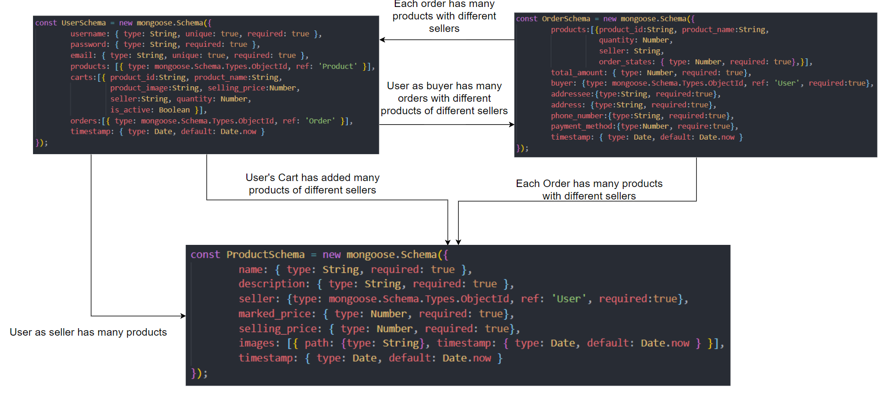

# e-commerce-platform-backend
[](https://travis-ci.com/chiksumwong/e-commerce-platform-backend)

## Run
```sh
$ npm install
$ npm test
$ npm start
```

## APIs Design
More APIs Information: 
- link: https://documenter.getpostman.com/view/3391889/S1Lr5XJJ

Or

- Import E-Commerce Platform APIs.postman_collection.json to Postman


### Account APIs
| APIs              | Method | Urls                                       |
| ----------------- | ------ | ------------------------------------------ |
| Register          | POST   | http://localhost:3000/api/v1/register      |
| Login             | POST   | http://localhost:3000/api/v1/login         |
| Get User By ID    | GET    | http://localhost:3000/api/v1/user/:user_id |
| Delete User By ID | DELETE | http://localhost:3000/api/v1/user/:user_id |

### Product APIs
| APIs              | Method | Urls                                             |
| ----------------- | ------ | ------------------------------------------------ |
| Create Product    | POST   | http://localhost:3000/api/v1/product             |
| Get All Products  | GET    | http://localhost:3000/api/v1/products            |
| Get Product By ID | GET    | http://localhost:3000/api/v1/product/:product_id |
| Update Product    | PUT    | http://localhost:3000/api/v1/product/:product_id |
| Delete Product    | DELETE | http://localhost:3000/api/v1/product/:product_id |

### Shopping Cart APIs
| APIs                            | Method | Urls                                       |
| ------------------------------- | ------ | ------------------------------------------ |
| Add Product to Shopping Cart    | POST   | http://localhost:3000/api/v1/cart          |
| Update Product in Shopping Cart | PUT    | http://localhost:3000/api/v1/cart/:user_id |

### Order APIs
| APIs                | Method | Urls                                         |
| ------------------- | ------ | -------------------------------------------- |
| Create order        | POST   | http://localhost:3000/api/v1/order           |
| Update Order States | PUT    | http://localhost:3000/api/v1/order/:order_id |

### Other APIs
| APIs                            | Method | Urls                                                 |
| ------------------------------- | ------ | ---------------------------------------------------- |
| Get products by seller id       | GET    | http://localhost:3000/api/v1/products/:user_id       |
| Get orders by buyer id          | Get    | http://localhost:3000/api/v1/orders/:user_id         |
| Get product orders by seller id | Get    | http://localhost:3000/api/v1/producstOrders/:user_id |


## Database Design (NOSQL Database Version)
<p>
<kbd>

</kbd>
</p>


## Database Design (SQL Database Version)
<p>
<kbd>

</kbd>
</p>
